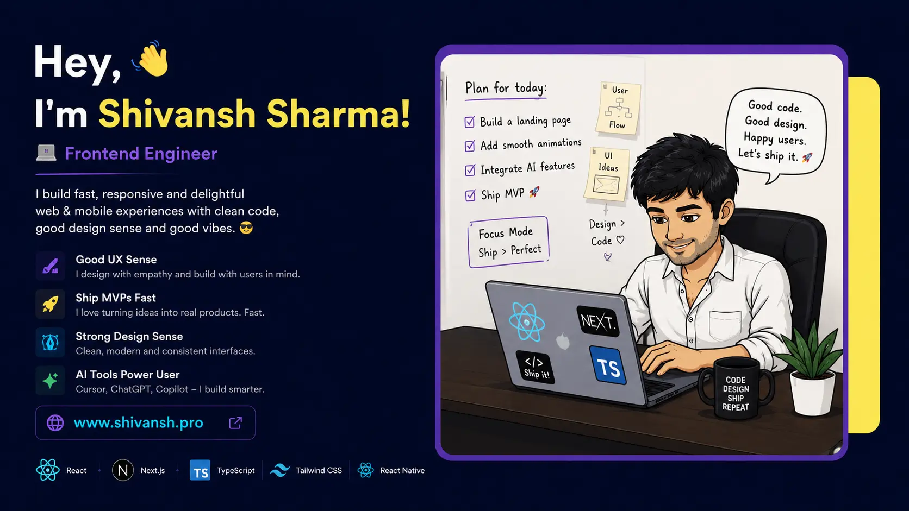

<!-- ============================================================ -->
<!--  BANNER                                                      -->
<!-- ============================================================ -->

<p align="center">
  
</p>

<br/>

<!-- ============================================================ -->
<!--  ANIMATED TAGLINE                                            -->
<!-- ============================================================ -->

<p align="center">
  <a href="https://www.shivansh.pro">
    
  </a>
</p>

<p align="center">
  <a href="https://www.shivansh.pro"></a>
  <a href="https://www.linkedin.com/in/sharmashiv24251/"></a>
  <a href="https://github.com/sharmashiv24251"></a>
  
</p>

<br/>

##  &nbsp;About me

```ts
const shivansh = {
  role:     "Frontend Engineer",
  based_in: "India 🇮🇳",
  stack:    ["React", "Next.js", "TypeScript", "Tailwind", "React Native"],
  building: ["fast", "responsive", "delightful"],
  loves:    ["clean code", "good design sense", "good vibes 😎"],
  mantra:   "Code. Design. Ship. Repeat."
};
```

I build **fast, responsive and delightful** web & mobile experiences. I design with empathy, ship MVPs quickly, and lean hard on modern AI tooling (Cursor, ChatGPT, Copilot) to build smarter, not harder.

- 🎨 **Strong design sense** — clean, modern, consistent interfaces
- 🚀 **Ship MVPs fast** — turning ideas into real products without overthinking
- 🤖 **AI tools power user** — Cursor + Copilot + ChatGPT in the daily flow
- 🌐 Currently building things at **[shivansh.pro](https://www.shivansh.pro)**

<br/>

## 🛠️ &nbsp;Tech I work with

<p>
  
  
  
  
  
  
</p>

<p>
  
  
  
  
  
  
</p>

<p>
  
  
  
  
  
  
</p>

<br/>

## 🚀 &nbsp;Featured projects

<table>
  <tr>
    <!-- ============== 💰 TOKEN PORTFOLIO ============== -->
    <td width="50%" valign="top">
      <a href="https://crypto-dashboard-taupe-theta.vercel.app/" target="_blank">
        
      </a>
      <h3>💰 &nbsp;Token Portfolio</h3>
      <p>
        A sleek crypto-tracking dashboard with live token prices, donut-chart portfolio breakdown, watchlist with sparklines, and full wallet connection. Pixel-perfect from Figma.
      </p>
      <p>
        
        
        
        
        
      </p>
      <p>
        <a href="https://crypto-dashboard-taupe-theta.vercel.app/"></a>
        <a href="https://github.com/sharmashiv24251/crypto-dashboard"></a>
      </p>
    </td>
    <!-- ============== 🎨 IMAGELAYOUTBUILDER ============== -->
    <td width="50%" valign="top">
      <a href="https://canvas-app-konva.vercel.app/" target="_blank">
        
      </a>
      <h3>🎨 &nbsp;ImageLayoutBuilder</h3>
      <p>
        A lightweight Canva / Excalidraw alternative — infinite canvas with shapes, text, arrows, images, drag-and-drop layers, inspector panel, undo/redo, and cross-window clipboard.
      </p>
      <p>
        
        
        
        
        
      </p>
      <p>
        <a href="https://canvas-app-konva.vercel.app/"></a>
        <a href="https://github.com/sharmashiv24251/canvas-app-konva"></a>
      </p>
    </td>
  </tr>
  <tr>
    <!-- ============== 🤖 AI CHAT SUPPORT ============== -->
    <td width="50%" valign="top">
      <a href="https://ai-chat-support-25h9.onrender.com" target="_blank">
        
      </a>
      <h3>🤖 &nbsp;AI Live Chat Support</h3>
      <p>
        An AI-powered shopping assistant built on <strong>Google Gemini</strong> — streaming responses, tool calling, product-aware context, and automatic model fallback (2.0 Flash Lite → 2.5 Flash → 2.5 Pro) for resilience under rate limits.
      </p>
      <p>
        
        
        
        
        
      </p>
      <p>
        <a href="https://ai-chat-support-25h9.onrender.com"></a>
        <a href="https://github.com/sharmashiv24251/ai-chat-support"></a>
      </p>
    </td>
    <!-- ============== 🌱 BHUMIO ============== -->
    <td width="50%" valign="top">
      <a href="https://github.com/sharmashiv24251/bhumio" target="_blank">
        
      </a>
      <h3>🌱 &nbsp;Bhumio</h3>
      <p>
        A full-stack TypeScript project with a dedicated frontend and backend. <em>(Add a description on the repo's About section to populate this card with more detail.)</em>
      </p>
      <p>
        
        
        
        
      </p>
      <p>
        <a href="https://github.com/sharmashiv24251/bhumio"></a>
      </p>
    </td>
  </tr>
</table>

<p align="center">
  <a href="https://github.com/sharmashiv24251?tab=repositories">
    
  </a>
</p>

<br/>

## 📊 &nbsp;GitHub stats

<p align="center">
  
  
</p>

<p align="center">
  
</p>

<p align="center">
  
</p>

<br/>

## 🤝 &nbsp;Let's connect

<p align="center">
  Got a cool idea? Want to collaborate? Just here to say hi?<br/>
  <em>I'm always down to chat about frontend, design, or shipping things fast.</em>
</p>

<p align="center">
  <a href="https://www.shivansh.pro">
    
  </a>
  <a href="https://www.linkedin.com/in/sharmashiv24251/">
    
  </a>
  <a href="https://github.com/sharmashiv24251">
    
  </a>
</p>

<br/>

<p align="center">
  <em>"Code. Design. Ship. Repeat." ☕</em>
</p>

<p align="center">
  
</p>
